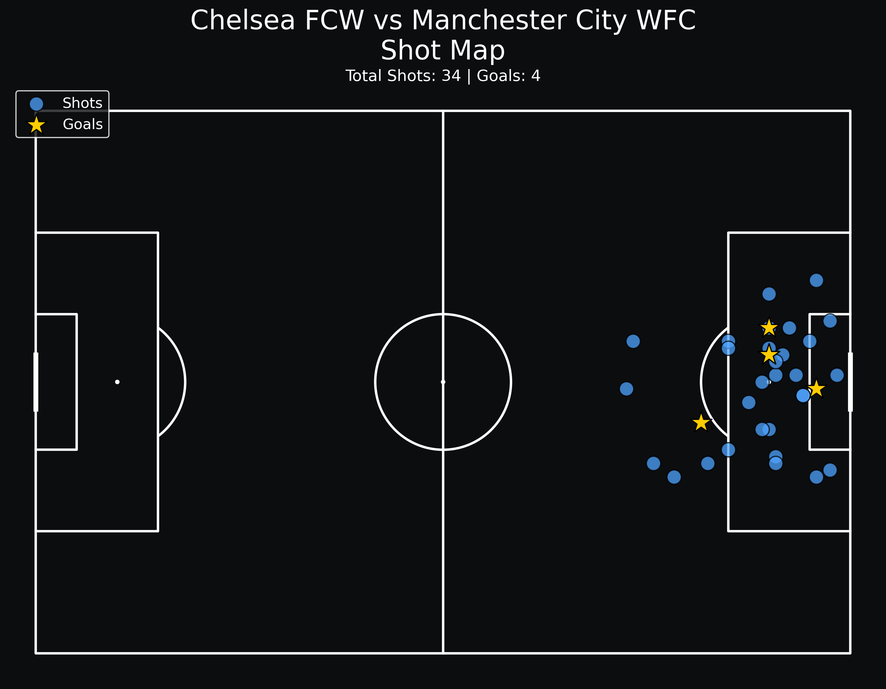
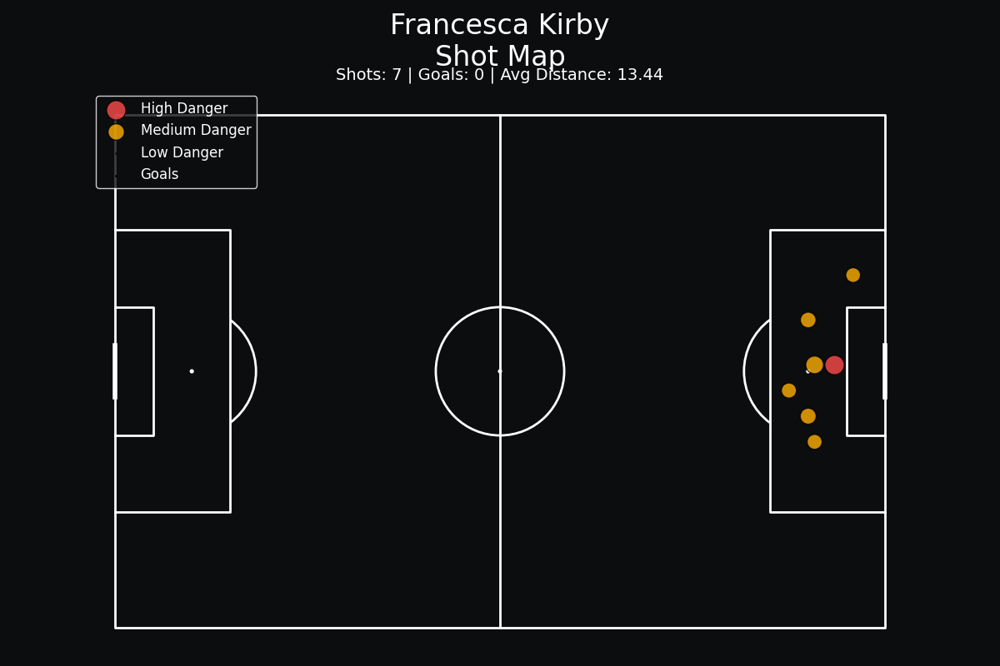

# Football Analytics Platform

A football analytics project applying analytics engineering principles to event-level football data.

This platform is being built to demonstrate how raw football event data can be transformed into structured analytical models, queried using SQL, and visualised through football-specific analytics visuals.

---

# Project Objectives

- Ingest football event data
- Transform nested JSON event data into structured relational tables
- Build a PostgreSQL analytical layer
- Create player and team performance metrics
- Produce football analytics visuals such as shot maps and pass maps
- Develop the foundation for a football analytics dashboard

---

# Current Progress

## Data Engineering
- PostgreSQL database created
- Event-level fact table created
- Player dimension table created
- Team dimension table created
- StatsBomb event data loaded into Python
- Event transformation pipeline created
- Structured event data inserted into PostgreSQL

## Analytics
- Player passing metrics created
- Team passing metrics created
- Shot distance feature engineering
- Shot danger classification logic implemented

## Visualisation
- Team shot maps created
- Player shot maps created
- Shot-quality visual encoding implemented

---

# Tech Stack

- Python
- PostgreSQL
- SQL
- Pandas
- Matplotlib
- mplsoccer

---

# Project Structure

football_analytics/
│
├── dashboard/            # Future dashboard application
│
├── data/
│   └── raw/              # Raw StatsBomb JSON files (excluded from GitHub)
│
├── docs/                 # Notes and documentation
│
├── scripts/              # Python ingestion, transformation and visualisation scripts
│
├── sql/                  # SQL table creation and analysis queries
│
├── visuals/              # Generated football analytics visuals
│
├── .gitignore
├── requirements.txt
└── README.md

---

# Example Outputs

## Team Shot Map

## Player Shot Map

---

# Data Source

This project currently uses open football event data provided by StatsBomb Open Data.

Raw data files are not included in this repository.

---

# Current Focus

Current development areas include:
- Player pass maps
- Progressive passing analysis
- Event feature engineering
- Shot-quality modelling
- Dashboard layer development

---

# Status

This project is actively being developed and expanded.